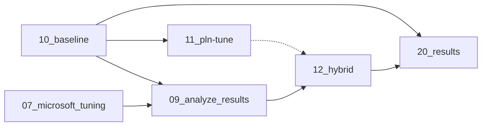

# Notebooks TFM

Estos notebooks son para el Trabajo de Fin de Máster de David Davó. La memoria puede encontrarse en el [Archivo Digital UPM](https://oa.upm.es)

## ¿Qué necesito?

Necesitaras jupyter notebook, y las dependencias están en el archivo [requirements.txt](./requirements.txt), puedes instalar todo lo necesario con `pip install -r requirements.txt`

Además, los datos se descargan de Kaggle, por lo que necesitarás instalar tu token. Véase [Kaggle - Public API](https://www.kaggle.com/docs/api).

## ¿En qué orden ejecutar los notebooks?

El número del notebook indica el orden en el que fueron creados. Los que contienen `mvp` eran pruebas, que tal vez hayan sido pasadas a código python y, probablemente, ya no se puedan ejecutar.

Para generar los gráficos y artefactos necesarios para la memoria del TFM es necesario ejecutar los notebooks usando el siguiente grafo de dependencias:

> Nota: Los notebooks 07_microsoft_tuing y 11_pln-tune pueden tardar horas en ejecutar

En general, se ha buscado que los experimentos sean replicables usando semillas donde fuese posible. Los datos descargados y ficheros intermedios se guardan en la carpeta [./data](./data), que no se sube a GitHub.

## Acknowledgments

Estos son los resultados del Trabajo de Fin de Máster de David Davó Laviña (Universidad Complutense de Madrid), del Master Universitario en Inteligencia Artificial de la Universidad Politécnica de Madrid, dirigido por Javier Bajo (Universidad Politécnica de Madrid) y Javier Arroyo (Universidad Complutense de Madrid).

Este trabajo de Fin de Máster en parte es relativo a dos proyectos:
PID2021-127956OB-I00 DAO APPLICATIONS: Evaluación de organizaciones autónomas descentralizadas
basadas en blockchain para la gestión de proyectos DeFi, NFT y Metaverso, financiado por MCIN/ AEI
/10.13039/501100011033/ y por FEDER Una manera de hacer Europa y el FEI-EU-22-03

## Citing

> Proximamente
